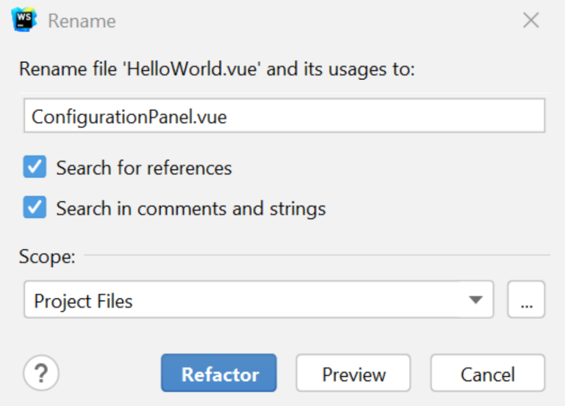
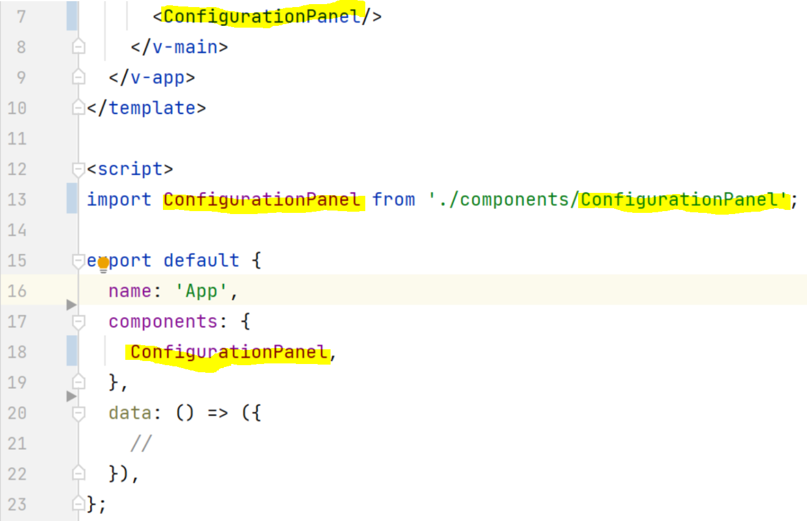
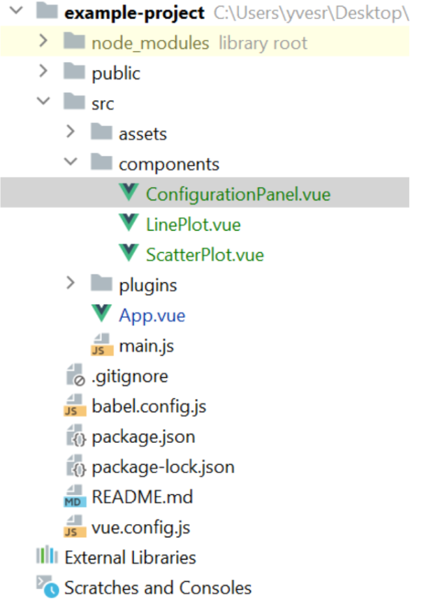
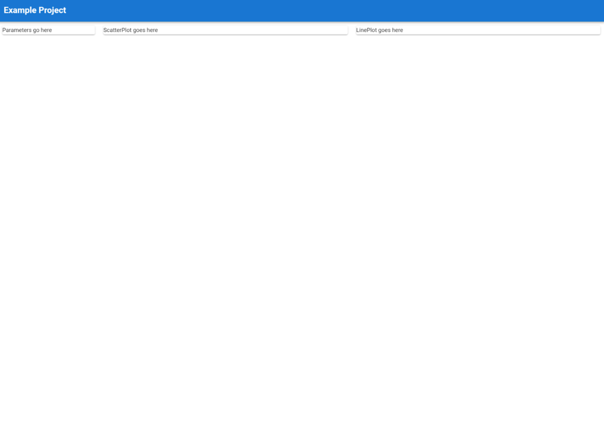

### Tutorial-1: Create the Frontend Components of Our Project

#### Create a Basic Layout

1. Search for the grid system vuetify using google and navigate to the respective website. Look at the code blocks and get to know the concept of placing elements on the website.
2. Navigate to "src/components/HelloWorld.Vue". Replace the ``<template>...</template>`` code with the following code snippet.
```html
<template>
  <div>
    <v-container fluid>
      <v-row>
        <v-col cols="12" md="2">
          <v-card>
            Parameters go here
          </v-card>
        </v-col>
        <v-col cols="12" md="5">
          <v-card>
            Plot 1 goes here
          </v-card>
        </v-col>
        <v-col cols="12" md="5">
          <v-card>
            Plot 2 goes here
          </v-card>
        </v-col>
      </v-row>
    </v-container>
  </div>
</template>
```
3. Change the header in "src/App.vue". Replace the code inside ``<template>...</template>``with the following code snippet:
```html
<template>
  <v-app>
    <v-app-bar app color="primary" dark>
      <h2>Example Project</h2>
    </v-app-bar>
    <v-main>
      <HelloWorld/>
    </v-main>
  </v-app>
</template>
```
4. Disable Scrolling: If your webapp does not need scrolling, I suggest to hide the scrollbar with the following code snippet (below </script>). Replace any existing styling in App.Vue and add:
```html
<style>
/* disable scrolling */
html {
  scrollbar-width: none; /* For Firefox */
  -ms-overflow-style: none; /* For Internet Explorer and Edge */
}
html::-webkit-scrollbar {
  width: 0px; /* For Chrome, Safari, and Opera */
}
</style>
```
5. Add 2 new Files/Components "ScatterPlot.vue" and "LinePlot.vue" in the Component folder "src/components".
6. Rename the "HelloWorld.vue" Component to "ConfigurationPanel.vue" using the refactoring functionality (right click on the file -> "refactoring"). Note: This will break your code, we will fix it in the next steps. Screenshot from Webstorm.



7. Rename "HelloWorld" to ConfigurationPanel inside "App.vue" at **4 positions**:



8. Your folder structure should look like the following now:



#### Nest Components
Nest LinePlot and ScatterPlot in the ConfigurationPanel so each component is responsible for a specific plot. This will allow us better encapsulation of our source code.
1. In src/ScatterPlot.vue add the following code that is responsible for all ScatterPlot related stuff:
```html
<template>
  <v-card>
    ScatterPlot goes here
  </v-card>
</template>
<script>
export default {
  name: "ScatterPlot"
}
</script>
```
2. In src/LinePlot.vue add the following code that is responsible for all the LinePlot related stuff:
```html
<template>
  <v-card>
    LinePlot goes here
  </v-card>
</template>
<script>
export default {
  name: "LinePlot"
}
</script>
```
3. Next, we have to nest the "ScatterPlot.vue" and "LinePlot.vue" components inside the ConfigurationPanel. To do so, replace the existing code in "src/ConfigurationPanel.vue" with:
```html
<template>
  <div>
    <v-container fluid>
      <v-row>
        <v-col cols="12" md="2">
          <v-card>
            Parameters go here
          </v-card>
        </v-col>
        <v-col cols="12" md="5">
          <ScatterPlot/>
        </v-col>
        <v-col cols="12" md="5">
          <LinePlot/>
        </v-col>
      </v-row>
    </v-container>
  </div>
</template>
<script>
import ScatterPlot from './ScatterPlot';
import LinePlot from './LinePlot';
export default {
  components: {ScatterPlot, LinePlot},
  data: () => ({
  }),
}
</script>
```
4. If you refresh your webapp on localhost. The final result should look like the following.
   Hint: If your server is not running, rerun with ```npm run serve```



#### References
[Vuetify Tutorial (Youtube Playlist) #13 - #14](https://www.youtube.com/watch?v=0Qv-6fQBFfA&list=PL4cUxeGkcC9g0MQZfHwKcuB0Yswgb3gA5&index=13)
