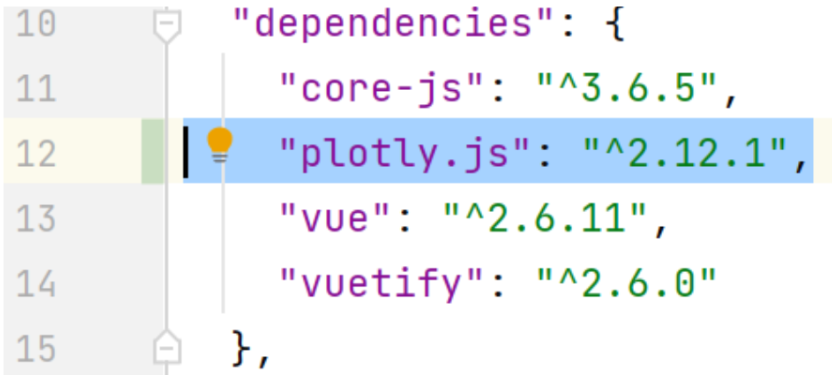
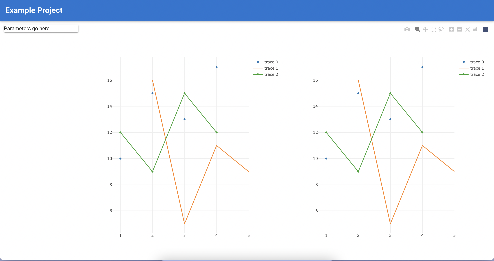

### Tutorial-2: Add Plotly.js and Basic Plots
References: Plotly, lifecycle vue

1. Stop the server (if running) with "ctrl+c" inside the IDE terminal. Hint: mesmorize the basic commands such as ``npm run serve`` to start the webapp or "ctrl+c" to stop it.
2. Add the "Plotly.js" library to our project. Run the following command in the IDE terminal
- Mac: ``sudo npm install plotly.js``
- Windows: ``npm install plotly.js``
3. Check whether the dependency is installed correctly inside package.json. The version might differ but the library name should be the same.



4. In "src/ScatterPlot.vue", replace the html code (inside the template tag) to the following.
   The outer div tag sets the height to 90vh (90% of screen height). In the inner div provides the location of the plot that is later loaded. By inheriting the height, we control the height of the plot. Remember: the width of the plot is determined by the grid system.
```html
<template>
    <div style="height: 90vh">
      <div id='myScatterPlot' style="height: inherit">
      </div>
    </div>
</template>
```
5. Import Plotly in src/ScatterPlot.vue inside the script tag. Then, create a method called drawScatterPlot() inside a script tag that is called when the Component is mounted. Hint: use single quote around 'ScatterPlot' in case of any related errors. Hint #2: Expect an error from ESLint that 'Plotly' is defined but never used no-unused-vars. We will fix it in the next step.


```html
<script>
import Plotly from 'plotly.js/dist/plotly';
export default {
  name: "ScatterPlot",
  data: () => ({
  }),
  mounted() {
    this.drawScatterPlot()
  },
  methods: {
    drawScatterPlot() {
      // plotly code comes later here
    }
  }
}
</script>
```
6. Navigate to https://plotly.com/javascript/line-and-scatter/, copy the scatterplot code and insert it into the method drawScatterPlot. Then replace “myDiv” with “myScatterPlot”.
```html
<script>
import Plotly from 'plotly.js/dist/plotly';
export default {
  name: "ScatterPlot",
  data: () => ({
  }),
  mounted() {
    this.drawScatterPlot()
  },
  methods: {
    drawScatterPlot() {
      var trace1 = {
        x: [1, 2, 3, 4],
        y: [10, 15, 13, 17],
        mode: 'markers',
        type: 'scatter'
      };
      var trace2 = {
        x: [2, 3, 4, 5],
        y: [16, 5, 11, 9],
        mode: 'lines',
        type: 'scatter'
      };
      var trace3 = {
        x: [1, 2, 3, 4],
        y: [12, 9, 15, 12],
        mode: 'lines+markers',
        type: 'scatter'
      };
      var data = [trace1, trace2, trace3];
      Plotly.newPlot('myScatterPlot', data);
    }
  }
}
</script>
```
7. Next, repeat steps 4-6 with the same code for the line plot in the linePlot component. Replace "myScatterPlot" with "myLinePlot" and "drawScatterPlot" with "drawLinePlot".
8. Your final result should look like the following.



#### References
[Plotly Javascript](https://plotly.com/javascript/)\
[Plotly Getting Started](https://plotly.com/javascript/getting-started/)\
[Plotly Line and Scatter Charts](https://plotly.com/javascript/line-and-scatter/)
