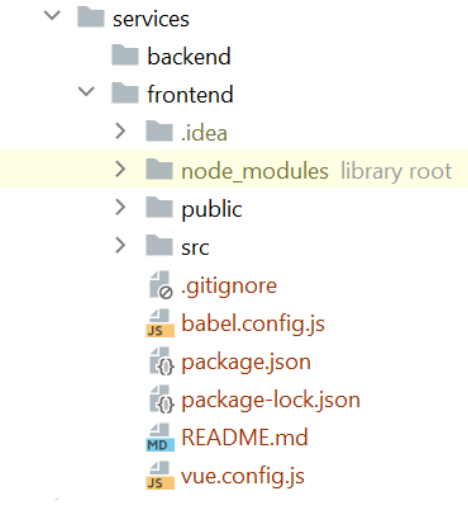
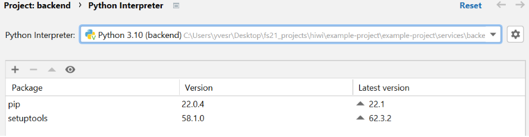
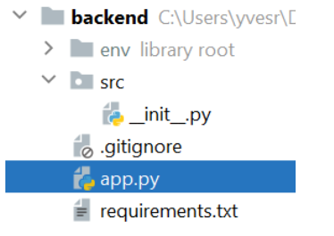

### Tutorial-3: Create the Backend
The goal of this tutorial is to create a basic backend and to create a dummy API endpoint.

#### Adapt the Folder structure
1. Create an empty "services" folder in the root project folder. Hint: Don't use the IDE to do that but use the explorer/finder.
2. Create a backend and frontend folder inside services
3. Move all other files from the project folder inside services/frontend.
4. You should have the following structure. Note: To run the frontend, you will now have to run ``npm run serve`` within ./services/frontend



#### Create a Virtual Environment and Install Libraries
1. Navigate to services/backend in your CMD or terminal.
2. Check that your python version is > 3.7 using ``python --version`` in your terminal.
3. Create a virtual environment using ``python -m venv env``
4. Depending on your IDE, perform one of the following steps.
    (1) Start PyCharm (also from Jetbrains Toolbox) and open project in folder services/backend. Then, select the Interpreter in the settings. (2) Inside the terminal in VS code, activate the environment inside ./services/backend using ``source ./env/bin/activate``. Then, run ``code .`` to open the current directory in a new VS code window. Next, select the recommended interpreter in the interpreter settings.
    
5. Open a terminal inside PyCharm and install the flask packages that are needed to serve the endpoints:
- ``pip install flask==2.1.1``
- ``pip install flask-restx==0.5.1``

#### Setup a Dummy endpoint
Create the following folder structure with the following files inside services/backend.
1. Create a Folder with the name "src"
2. Create the file "src/\_\_init\_\_.py" (2 underscores before and after “init”)
3. Create the file "app.py".
4. Create a "requirements.txt" file.
5. You should have the following files and folder structure:



6. Inside "src/\_\_init\_\_.py", add the following code for a first dummy "ping->pong" endpoint. This is boilerplate flask and flask-restx code so that endpoints can easily be created. This will be refactored in the future.
```python
from flask import Flask
from flask_restx import Resource, Api
# instantiate the app
app = Flask(__name__)
api = Api(app)
class Ping(Resource):
    def get(self):
        return {
            'status': 'success',
            'message': 'pong!'
        }
api.add_resource(Ping, '/ping')
```
7. In app.py, add the following code.
- Using the debug flag, we can refresh the application upon ctrl+s.
```python
from src import app
if __name__ == '__main__':
    app.run(debug=True)
```
8. Inside a terminal in the PyCharm IDE, run ```python app.py run```. This will run our backend application and make our endpoints accessible. Hint: Make sure you are in the services/backend folder inside the terminal.
9. Copy the URL after running (e.g. http://127.0.0.1:5000) and add /ping in the browser. Complete URL: http://127.0.0.1:5000/ping and you should see the following:
```
{
"status": "success",
"message": "pong!"
}
```
#### References
[Install PyCharm and Python Tutorial](https://www.youtube.com/watch?v=LzYNWme1W6Q)\
[Simple Flask Tutorial](https://www.youtube.com/watch?v=mqhxxeeTbu0)
