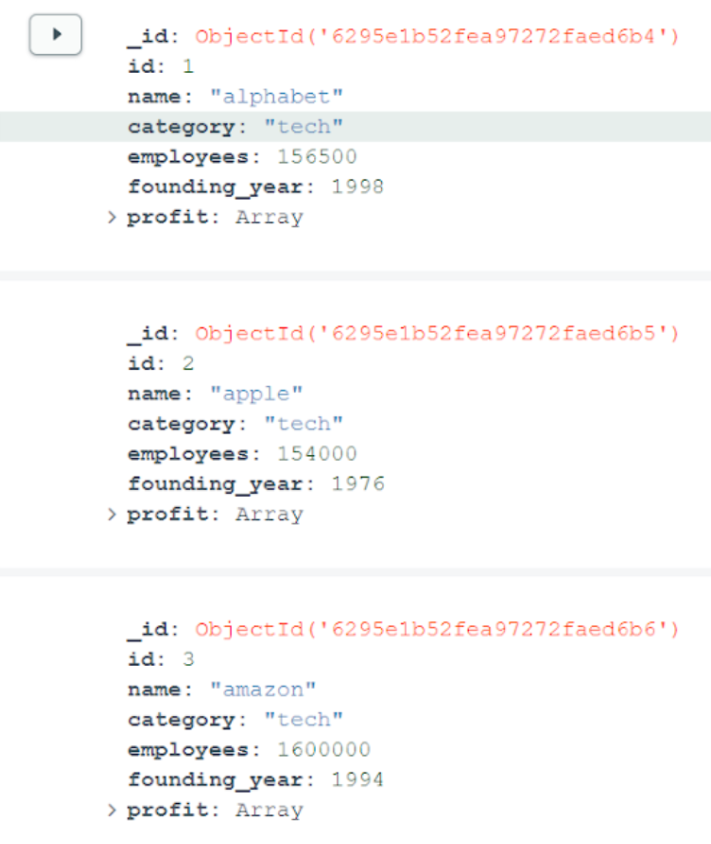

### Tutorial-4 Setup MongoDB
We will add the data to a nosql MongoDB database. Then we will access the database in the backend and create two endpoints. One endpoint to get information of all companies and one endpoint to get information of a specific endpoint.

#### Install MongoDB and Import the Data
1. Install MongoDB and MongoDB Compass.
- https://www.mongodb.com/docs/manual/installation/
- https://www.mongodb.com/docs/compass/current/install/
- Hint: Troubleshooting with M1 macbook for errors with brew: https://stackoverflow.com/questions/64882584/how-to-run-the-homebrew-installer-under-rosetta-2-on-m1-macbook
2. Launch the MongoDB Compass and click "connect" to the localhost. (Be sure mongodb is started in case of any errors)
3. Click on Databases and create a database called "companiesdatabase" with the collection name "companies"
4. Navigate inside the newly create companies collection inside the companiesdatabase database and click add data. Then, import the [companies.json](https://drive.google.com/file/d/1v7aDKU86zBzAgcF0erztwqmSB_YYKWJD/view?usp=sharing). Your result should look something like this:



#### Create the Endpoints
We will build a minimalistic REST API using Flask so that we can
(1) retrieve all companies and (2) retrieve a specific company based on the ID.

1. Install 4 more libraries using the terminal inside PyCharm (make sure your virtual environment is activated):
- ``pip install fastapi``
- ``pip install flask_pymongo``
- ``pip install pymongo``
- ``pip install flask_cors``
2. Create a "model.py" file in the folder "src".
3. Add the following code.
- The companies object has the same variables as in the database.
- The to_json method helps us to convert the python object to a json object so we can pass it to the API endpoint.
```python
from fastapi.encoders import jsonable_encoder
from pydantic import BaseModel
from typing import List
class Company(BaseModel):
        id: int
        name: str
        category: str
        founding_year: int
        employees: int
        profit: List
        def to_json(self):
            return jsonable_encoder(self, exclude_none=True)
```
4. In "src/\_\_init\_\_.py" add the following code.
- The get method for the CompaniesList retrieves all Companies
- The get method for the Companies retrieves a single Company

```python
from flask import Flask
from flask_cors import CORS
from flask_restx import Resource, Api
from flask_pymongo import PyMongo
from pymongo.collection import Collection
from .model import Company
# Configure Flask & Flask-PyMongo:
app = Flask(__name__)
# allow access from any frontend
cors = CORS()
cors.init_app(app, resources={r"*": {"origins": "*"}})
# add your mongodb URI
app.config["MONGO_URI"] = "mongodb://localhost:27017/companiesdatabase"
pymongo = PyMongo(app)
# Get a reference to the companies collection.
companies: Collection = pymongo.db.companies
api = Api(app)
class CompaniesList(Resource):
      def get(self):
          cursor = companies.find()
          return [Company(**doc).to_json() for doc in cursor]
class Companies(Resource):
      def get(self, id):
          cursor = companies.find_one_or_404({"id": id})
          company = Company(**cursor)
          # do preprocessing, machine learning etc.
          return company.to_json()
api.add_resource(CompaniesList, '/companies')
api.add_resource(Companies, '/companies/<int:id>')
```
5. Run ``python app.py run`` and navigate to http://127.0.0.1:5000/companies and you should see the following (only showing 2 companies):
```
[
    {
    "id": 1,
    "name": "alphabet",
    "category": "tech",
    "founding_year": 1998,
    "employees": 156500,
    "profit": [
      {
      "year": 2021,
      "value": 76033
      },
      {
      "year": 2020,
      "value": 40269
      },
      {
      "year": 2019,
      "value": 34343
      },
      {
      "year": 2018,
      "value": 30736
      },
      {
      "year": 2017,
      "value": 12662
      }
    ]
    },
    {
    "id": 2,
    "name": "apple",
    "category": "tech",
    "founding_year": 1976,
    "employees": 154000,
    "profit": [
      {
      "year": 2021,
      "value": 94680
      },
      {
      "year": 2020,
      "value": 57410
      },
      {
      "year": 2019,
      "value": 55260
      },
      {
      "year": 2018,
      "value": 59530
      },
      {
      "year": 2017,
      "value": 48350
      }
    ]
    },
...
]
```
6. Navigate to http://127.0.0.1:5000/companies/1 and you should see the following:
```
{
"id": 1,
"name": "alphabet",
"category": "tech",
"founding_year": 1998,
"employees": 156500,
"profit": [
    {
    "year": 2021,
    "value": 76033
    },
    {
    "year": 2020,
    "value": 40269
    },
    {
    "year": 2019,
    "value": 34343
    },
    {
    "year": 2018,
    "value": 30736
    },
    {
    "year": 2017,
    "value": 12662
    }
]
}
```
#### References
[MongoDB Crash Course 2022](https://www.youtube.com/watch?v=2QQGWYe7IDU)\
[Python REST API Tutorial - Building a Flask REST API](https://www.youtube.com/watch?v=GMppyAPbLYk)\
[Flask RESTful routing](https://flask-restful.readthedocs.io/en/latest/quickstart.html)\
[Flask-CORS](https://flask-cors.readthedocs.io/en/latest/#)
