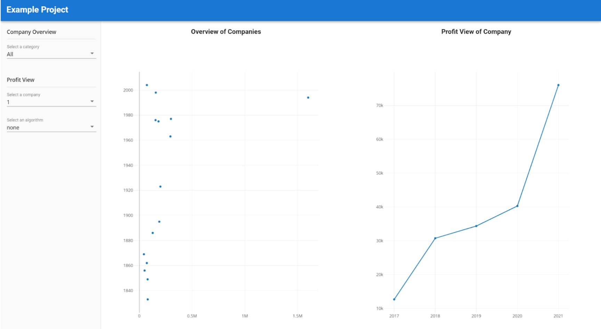

### Tutorial-5: Visualize the Company Data in the Frontend with Plotly
In this tutorial, we will improve the general styling, the plots and make updates to the configuration panel. So let's start!

1. Run the backend inside a terminal in PyCharm using ``python app.py run``
2. Run the frontend inside a terminal in WebStrom using ``npm run serve``
3. Visualize all companies using a scatterplot. In src/components/Scatterplot.vue, replace the javascirpt code inside the script tag. The comments explain the code.
```html
<script>
import Plotly from 'plotly.js/dist/plotly';
export default {
  name: "ScatterPlot",
  data: () => ({
    ScatterPlotData: {x: [], y: []}
  }),
  mounted() {
    this.fetchData()
  },
  methods: {
    async fetchData() {
      // req URL to retrieve companies from backend
      var reqUrl = 'http://127.0.0.1:5000/companies'
      console.log("ReqURL " + reqUrl)
      // await response and data
      const response = await fetch(reqUrl)
      const responseData = await response.json();
      // transform data to usable by scatterplot
      responseData.forEach((company) => {
        this.ScatterPlotData.x.push(company.employees)
        this.ScatterPlotData.y.push(company.founding_year)
      })
      // after the data is loaded, draw the plot
      this.drawScatterPlot()
    },
    drawScatterPlot() {
      var trace1 = {
        x: this.ScatterPlotData.x,
        y: this.ScatterPlotData.y,
        mode: 'markers',
        type: 'scatter'
      };
      var data = [trace1];
      Plotly.newPlot('myScatterPlot', data);
    }
  }
}
</script>
```
4. Visualize the profit of 1 company in "LinePlot.vue". Later, we will allow to dynamically set the IDs through the drop-down.
```html
<script>
import Plotly from 'plotly.js/dist/plotly';
export default {
  name: "LinePlot",
  data: () => ({
    LinePlotData: {x: [], y: []}
  }),
  mounted() {
    this.fetchData()
  },
  methods: {
    async fetchData() {
      // req URL to retrieve single company from backend
      var reqUrl = 'http://127.0.0.1:5000/companies/1'
      console.log("ReqURL " + reqUrl)
      // await response and data
      const response = await fetch(reqUrl)
      const responseData = await response.json();
      // transform data to usable by lineplot
      responseData.profit.forEach((profit) => {
        this.LinePlotData.x.push(profit.year)
        this.LinePlotData.y.push(profit.value)
      })
      // draw the lineplot after the data is transformed
      this.drawLinePlot()
    },
    drawLinePlot() {
      var trace1 = {
        x: this.LinePlotData.x,
        y: this.LinePlotData.y,
        type: 'scatter'
      };
      var data = [trace1];
      Plotly.newPlot('myLinePlot', data);
    }
  }
}
</script>
```

#### Adjust the Configuration Panel
We will create 3 dropdowns:
- 1 dropdowns to switch between categories in the Company Overview (Scatterplot with companies)
- 1 dropdown to select a specific company in the Profit View (Lineplot)
- 1 dropdown to switch between algorithms in the Profit View

1. Replace the existing code for the side bar ("parameters go here") with the following code inside the ConfigurationPanel.vue. This code uses v-select as a dropdown which is based on material design. We add 2 rows:
- 1 row where we specify that the selectors is concerning the Company Overview
- 1 row with the possible categories as a dropdown
```html
<v-row>
      <v-col cols="12" sm="12">
        <div class="control-panel-font">Company Overview</div>
      </v-col>
</v-row>
<v-row>
      <v-col cols="12" sm="12">
          <v-select
              :items="categories.values"
              label="Select a category"
              dense
              v-model="categories.selectedValue"
          ></v-select>
      </v-col>
</v-row>
```         

2. Just below the data in the script tag, we need to add the categories variable like that. For now we will just add the categories manually. This could be improved in the future with an API call
```javascript
data: () => ({
    categories: {
      values: ['All', 'tech', 'health', 'bank'],
      selectedValue: 'All'
    },
})
...
```

3. Next, we need to create the same for the other 2 dropdowns below the categories dropdown.
```html
<v-row>
      <v-col cols="12" sm="12">
          <div class="control-panel-font">Profit View</div>
      </v-col>
</v-row>
<v-row>
      <v-col cols="12" sm="12">
          <v-select
              :items="companies.values"
              label="Select a company"
              dense
              v-model="companies.selectedValue"
          ></v-select>
      </v-col>
</v-row>
<v-row>
      <v-col cols="12" sm="12">
          <v-select
              :items="algorithm.values"
              label="Select an algorithm"
              dense
              v-model="algorithm.selectedValue"
          ></v-select>
      </v-col>
</v-row>
```
4. The Javascript code below the respective categories code.
```javascript
data: () => ({
    categories: {
      values: ['All', 'tech', 'health', 'bank'],
      selectedValue: 'All'
    },
    companies: {
      values: [1, 2, 3, 4, 5, 6, 7, 8, 9, 10, 11, 12, 13, 14, 15],
      selectedValue: 1
    },
    algorithm: {
      values: ['none', 'random', 'regression'],
      selectedValue: 'none'
    }
  }),
```
5. Add styling to your configuration panel. add a side bar class to your v-col (that has md="2").
```html
<v-col cols="12" md="2" class="sideBar">
...
</v-col>
```
6. Add the respective styling to the two classes control-panel-font and sideBar. Below the script tag, add the following code. Note: This is not mandatory but it will be easier to distinguish the Configuration Panel from the rest of the other views.
```html
<style scoped>
.control-panel-font {
  font-family: "Open Sans", verdana, arial, sans-serif;
  align-items: center;
  font-size: 15px;
  border-bottom: 1px solid rgba(0, 0, 0, 0.1);
  display: flex;
  font-weight: 500;
  height: 40px;
}
.sideBar {
  border-right: 1px solid rgba(0, 0, 0, 0.1);
  background: #fafafa;
  padding-left: 17px;
  height: calc(100vh - 50px);
}
</style>
```

#### Small Improvements of the LinePlot and ScatterPlot Components
We will add a title and remove the modebar for the Plots.

1. Replace the html code inside the template tag with the following code in ScatterPlot.vue.
- align="center" and justify="center" will center the title
- class="mt-1 mb-0" will add 1px top margin and px bottom margin.
```html
<template>
      <div>
        <v-row align="center" justify="center" class="mt-1 mb-0">
          <h3>Overview of Companies</h3>
        </v-row>
        <div style="height: 90vh">
          <div id='myScatterPlot' style="height: inherit"></div>
        </div>
      </div>
</template>
```
2. Adjust the drawScatterPlot function and add the following code.
```javascript
...
var layout = {}
var config = {responsive: true, displayModeBar: false}
Plotly.newPlot('myScatterPlot', data, layout, config);
...
```
3. Do the equivalent for the Profit View. Replace the html code inside the template tag in LinePlot.vue.
```html
<template>
      <div>
        <v-row align="center" justify="center" class="mt-1 mb-0">
          <h3>Profit View</h3>
        </v-row>
        <div style="height: 90vh">
          <div id='myLinePlot' style="height: inherit"></div>
        </div>
      </div>
</template>
```
4. Adjust the drawLinePlot function and add the following code.
```javascript
...
var layout = {}
var config = {responsive: true, displayModeBar: false}
Plotly.newPlot('myLinePlot', data, layout, config);
...
```
5. Your final result should look like the following:



#### References
[Vue.JS 2 Tutorial (Youtube Playlist) #6 - #8](https://www.youtube.com/watch?v=VqKjr4I4Fdo&list=PL4cUxeGkcC9gQcYgjhBoeQH7wiAyZNrYa&index=7)\
[Vuetify Tutorial (Youtube Playlist) #12](https://www.youtube.com/watch?v=ml9M8i9F56E&list=PL4cUxeGkcC9g0MQZfHwKcuB0Yswgb3gA5&index=12)
