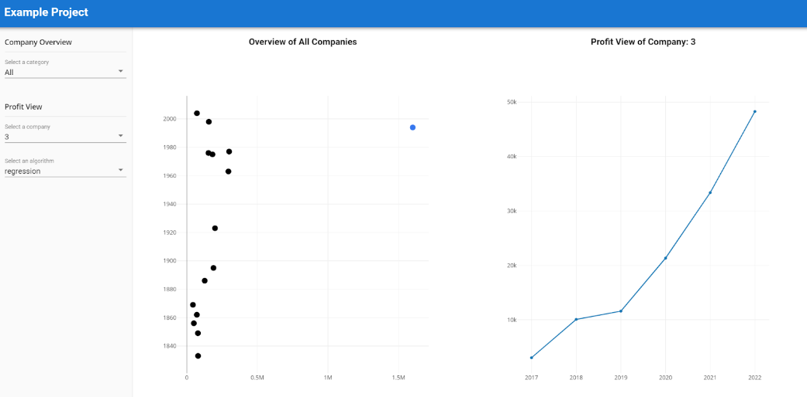
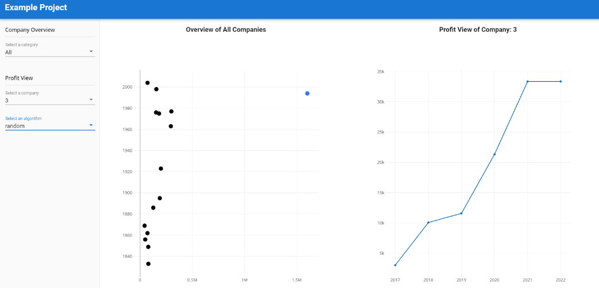

### Tutorial-8: Implement the Algorithms
In this tutorial, we will adjust the backend to switch between different models depending on the user specified algorithm.

1. Switch to PyCharm, stop the running backend with ``ctrl + c`` in the terminal and install the following 2 libraries:
- ``pip install pandas``
- ``pip install statsmodels``

2. Replace the get function inside Companies Class (not CompaniesList) with the following code in the Backend \_\_init\_\_.py. The code is explained in the comments.
```python
def get(self, id):
    import pandas as pd
    from statsmodels.tsa.ar_model import AutoReg
    # search for the company by ID
    cursor = companies.find_one_or_404({"id": id})
    company = Company(**cursor)
    # retrieve args
    args = request.args.to_dict()
    # retrieve the profit
    profit = company.profit
    # add to df
    profit_df = pd.DataFrame(profit).iloc[::-1]
    if args['algorithm'] == 'random':
        # retrieve the profit value from 2021
        prediction_value = int(profit_df["value"].iloc[-1])
        # add the value to profit list at position 0
        company.profit.insert(0, {'year': 2022, 'value': prediction_value})
    elif args['algorithm'] == 'regression':
        # create model
        model_ag = AutoReg(endog=profit_df['value'], lags=1, trend='c', seasonal=False, exog=None, hold_back=None,
                           period=None, missing='none')
        # train the model
        fit_ag = model_ag.fit()
        # predict for 2022 based on the profit data
        prediction_value = fit_ag.predict(start=len(profit_df), end=len(profit_df), dynamic=False).values[0]
        # add the value to profit list at position 0
        company.profit.insert(0, {'year': 2022, 'value': prediction_value})
    return company.to_json()
```
3. Run the frontend and the backend. The final result should look something like the following.



and



#### References
[10 Time Series Forecasting Methods We Should Know](https://cprosenjit.medium.com/10-time-series-forecasting-methods-we-should-know-291037d2e285)
